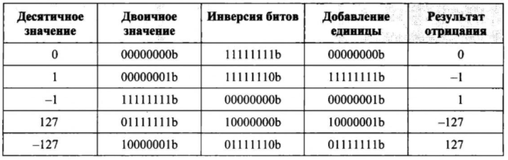

Глава 1. Введение в архитектуру компьютеров.

# Архитектура компьютеров

## Представление чисел уровнями напряжений

Часто: низкий - 0, высокий - 1. Нет реакции на промежуточные значения.

## 2ый и 16ричные числа

Наименьшая ед. инф. - бит (0 или 1). Байт - наименьшая адр. ед. инф. Часто байт - 8 бит.

Биты нумеруются справа налево, от наименее значащего к старшему биту.

*Установленный бит имеет значение 1, обнуленные - 0.*

### Дополнительный код

8-битные числа со знаком = [-128, 127]. Старший бит - знак. Отрицание числа в *дополнительном коде* - инвертирование всех бит, добалвение 1 и игнор. переноса.

Арифметика идентична безнаковой.

# 6502

*Длинна слова* - определяет размер основного элемента данных с которым работает проц.

В дан. сл. 8 бит это означает, что 6502 считывает и записывает данные в память по 8 бит за раз и хранит данные в 8-разр. рег.

*Регистр* - это место в логическом устройстве, в котором хранится слово информации. Исп. для вычислений.

### Инструкции

*Интсрукции* - это отдельные команды процессора, которые выстраиваются в последовательность для выполнения алгоритма.

Каждая инструкция  6502 состоит из 1-байтового кода операции (opcode), и может сопровождаться байтами операндов (0 - 2).

*Язык ассемблера* - форма представления исходного кода в виде набора инструкций.
