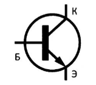
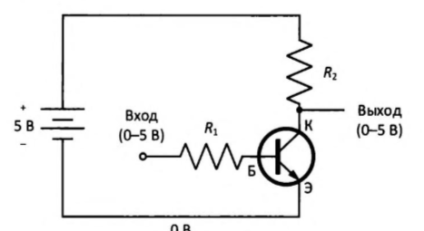
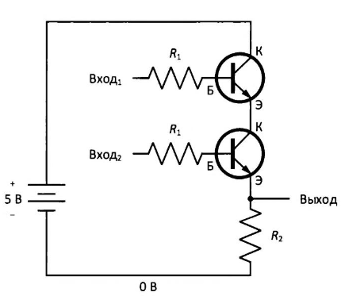
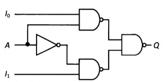
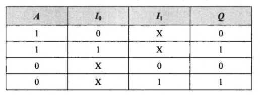
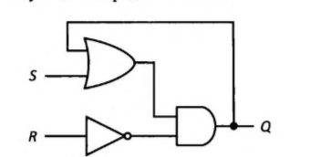
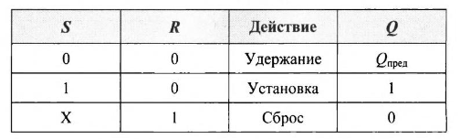
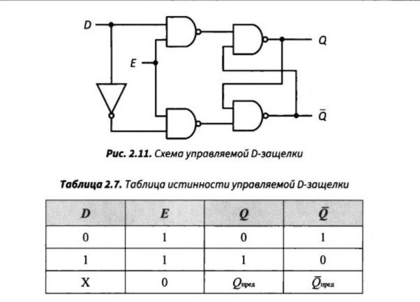
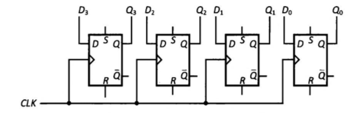
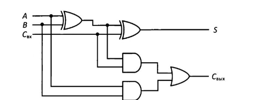

Цифровая логика

# Электрические схемы

*Транзистор* цифровой переключатель.

## Логические вентили

### Вентиль НЕ

Когда на входе высокий уровень - на выходе низкий, и на оборот.

*Таблица истиности* - это табличной представление выходного значения логического элемента как функция всех возможных комбинаций входных данных.

Т.И. НЕ:

| вход | выход |
| -------- | ---------- |
| 1        | 0          |
| 0        | 1          |

### Вентиль ИЛИ

### Мультиплексор

Выбор источника.

*Комбинационная логика* - схемы, состояющие из логических вентилей или логические вентили, состояния выходов которых зависит только от текущего состояния воходов.

## Защелки

На вход логических элементов можно подовать выходы последующих элементов (обратная связь).

*Защелка* - однобитное запоминающие устройство. Тип сверху - *защелка с установкой и сбросом, SR latch*.

### Управляемая D-защелка

Данная защелка - устр., *запус. по уровню сигнала*.

*Общая тактовая тактовая частота* - частота сигнала синхронизации для нескольких устройств, необходима для ухода от учета скорости распространения сигнала.

В конфигурации с общим тактовым генератором, компоненты срабатывают по фронту или спаду импульса.

## Триггеры

Устройства, похожие на защелки, но меняющие состояние выхода, когда тактовый сигнал совершет переход между уровнями - *устройство, запускаемое по фронту сигнала*.

## Регистры

Операции записи/чтения вы полняются паралельно - все биты регистра читаются одновременно, по отдельным сигнальным линиям.

Для маршрутизации данных из выбранного источника в регистр можно использовать мультиплексор.

## Сумматор

Устройство, сум. 2 бита - *полусумматор*, и если учитывает перенос - *полный сумматор*.

