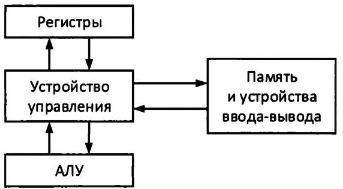
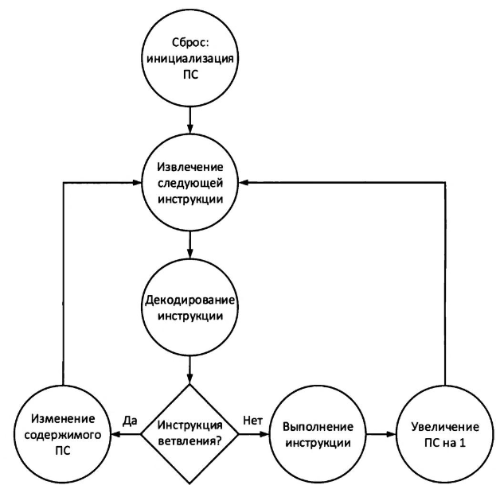
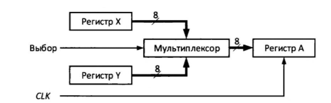

Элементы процессора

## Простой процессор

*Центральный процессор* (ЦП)

Элементы 6502:

* *Устройство управления* (УУ) - извлеч. декод. интср; опред. опер.; распределение действ. по элементам проц.
* *Арифметико-логическое устройство* (АЛУ) - комбинационная схема, которая вып. арифм. действия и опер. с битами
* *Набор регистров* - входи/выход рез. инструкций; временное хранилище.



## УУ

УУ - последовательная схема. Работает с инструкциями, взаимодействует с внешними устройствами.

После начала выполнения прогр. УУ загружает в себя *программный счетчик* (ПС) (адрес ячейки памяти первой инструкции). Затем УУ загружает слово инструкии (ее опкод), затем на основе битового шаблона опкода, УУ может загрузить слова следующие за опкодом.

Есть две категории инструкции - ветвление и обычные инстр. Ветвление выполняет сам УУ - они вызывают смену содержимого ПС. Обычные инстр. выполняют другие устройства, затем ПС указывает на адрес следующий инстр.



## Выполнение TXA на 6502



1. УУ подоет сигнал на *Выбор* о выборе регистра X.
2. УУ ждет пока все сигналы дойдут из мультиплексора до регистра А.
3. УУ подоет на CLK сигнал, по фронту которого загружаться данные в А из X.

## АЛУ

АЛУ - комбинационная схема.

Выполняем арифм. или битовые операции, на вход принимает операнды, код опер. и флаги, на выходе результат и флаги.

## Регистры

Регистры процессора - его области памяти (каждый обычно размера слова процессора), являются входами и результатами операций, обеспечивают наиболее быстрый к данным в проц.

Во многих архитектурах процов. определенные регистры выделяются для передачи/получения входных/выходных данных операций.

* *CISC* (complex instrucion set computer) - большой набор инстр., одна инструкция может загружать из памяти, выполнять опер., выгружать в память; занимает много тактов проц. Имеет меньше регистров.
* RISC (reduce instruction set computer) - меньшее количество инстр, одна инстр - простая задача. Больше регистров.

## Режимы адресации

### Непосредственная адресация

Данные в инструкции

```armasm
LDA #$O4
CLC
ADC #$03 ; # - знач, $ - 16рич
```

### Абсолютная (прямая) адресация

Адрес ячейки в инструкции

```armasm
LDA #$O4
STA $0203
LDA #$04
STA $0202
LDA $0203
CLC
ADC $0202
```

### Абсолютная индексная адресация

Вычисление адреса по базовому адресу и некоторому значению.

```armasm
LDA #$O4
STA $0203
LDA #$04
STA $0202
LDX #$03
CLC
LDA $0200, X
DEX ; X -= 1
ADC $0200, X
```

### Косвенная индексная адресация

Как абсолютная индексная, но база храниться в аппаратно заданном диапазоне (6502 - [00, ff])

## Категории инструкций

* Инструкции загрузки и сохр.
* Инстр. передачи данных между регистрами
* Инструкции стека
* Арифм. инстр.
* Логический инстр.
* Инстр. ветвления
* Инструкции вызова/возвр. подпрограмм
* Инструкции для работы с флагами
* Инструкции для работы с прерываниями
* Инстр. no-op

## Ввод-вывод

Перенос/ввод данныз из/во внешн. мир

Доступ к переф. устр:

* *ввод-вывод с распр. памяти* - устройством выдаются диап. адр. сист. памяти, и по этим адресам и происходит обращение (6502)
* *ввод-вывод с распр по портам* - отдельное адр. простр, отдельные интсрукции процессора, адрес устр. - номер порта. (x86)

Типы обработки ввода-вывода

### Программируемый ввод-вывод

Процессор периодически сам проверяет состояние устройства. Проц сам перемещает данные из/в устр.

### Ввод-вывод с управлением по прерываниям

Устройство само оповещает проц. о изменение состояния (6502 IRQ). Проц сам перемещает данные из/в устр.

### Direct memory access (DMA)

Отдельный контроллер DMA перемещает данные между устройствами и памятью, генерируя прерыв уже после заверш. опер.
