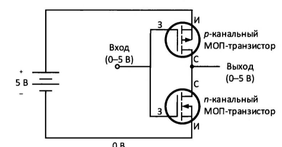
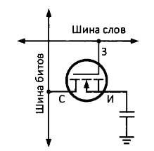
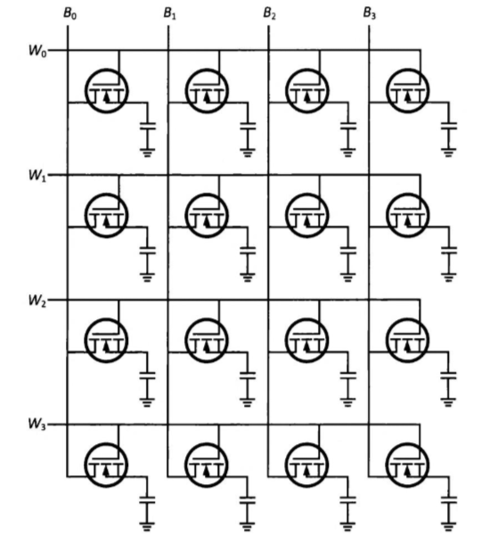

# Компоненты компьютерной системы

## Подсистема памяти

Это адресуемая последовательность ячеек памяти, содержащая инструкции и данные для исполнения процессором программ.

## МОП-транзистор

Униполярные транзистор (пологается только на один тип носителя). *Полевой транзистор на основе структуры метал-оксид-проводник* (полевой МОП-транзистор *metal-oxide-semicoductor field-effect transistor, MOSFET*). Управляется напряжением, а не током. Может работать в режиме *обогащение* или *обеднения* носителями.

Устройство на паре МОПТ называется *комплементарной МОП-сруктурой* (КМОП-схемой)

КМОП не:

## Схемы DRAM на МОПТ

DRAM (dynamic random access memory) состоит из МОПТ и конденсатора.

Битовая ячейка DRAM:

Строится матрица где в строке - слова, слово выбирается *шиной слов*. Когда нужно прочитать слово, на нужный ряд подоется высокое напряжение, и значение битов поступает на *шину битов*.

Банк памяти 1-битных слов, 16 бит:

Типичные устройства DRAM имеют размер слова - 8 бит.

## SDRAM DDR5

Double datad rate - операция с памятью по фронту и по спаду тактового сигнала памяти. SDRAM - synchronous DRAM, память синхронизована с контроллером памяти процессора с помощью общего тактового сигнала.

*Контроллер памяти* - последовательное логическое устройство, управляющее обменом данных между процессором и модулями оперативной памяти, выбирает модуль DDR, группу банков, банк и строку/столбец в банке.
